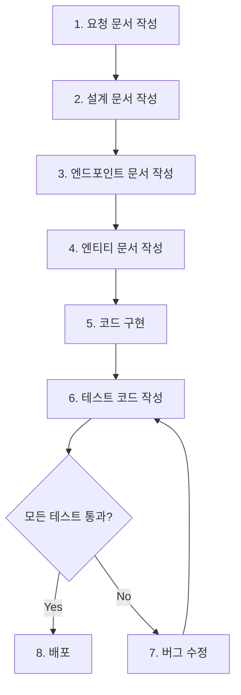

# 개발 워크플로우 가이드

이 문서는 FastAPI 서버 템플릿에서 **새로운 기능을 개발하는 전체 워크플로우**를 단계별로 설명합니다.

## 목차
1. [워크플로우 개요](#워크플로우-개요)
2. [단계별 상세 가이드](#단계별-상세-가이드)
3. [실전 예시: 게시글(Post) 기능 추가](#실전-예시-게시글post-기능-추가)
4. [자주 묻는 질문](#자주-묻는-질문)

---

## 워크플로우 개요



### 필수 원칙

✅ **문서 → 코드 → 테스트 → 배포** 순서 엄수
✅ 각 단계 완료 후 검토
✅ 테스트 통과 없이 배포 금지

---

## 단계별 상세 가이드

### 1단계: 요청 문서 작성

**목적**: 무엇을, 왜 만들지 명확히 정의

**작업**:
1. `docs/00_template/request_template.md` 복사
2. `docs/[기능명]_request.md` 파일명으로 저장
3. 다음 내용 작성:
   - 기능명, 요청일, 담당자
   - 요청 배경 (왜 필요한가?)
   - 기능 설명 (무엇을 만들 것인가?)
   - 주요 요구사항
   - 예상 엔드포인트
   - 데이터 모델 초안
   - 비즈니스 로직
   - 성공 기준

**예시**: `docs/example/user_request.md`

**체크포인트**:
- [ ] 기능의 목적이 명확한가?
- [ ] 주요 요구사항이 구체적인가?
- [ ] 예상 엔드포인트가 RESTful한가?

---

### 2단계: 설계 문서 작성

**목적**: 어떻게 구현할지 상세 설계

**작업**:
1. `docs/00_template/design_template.md` 복사
2. `docs/[기능명]_design.md` 파일명으로 저장
3. 다음 내용 작성:
   - 3-tier 아키텍처 계층별 책임
   - Router, Service, Repository 주요 메서드
   - 데이터 흐름 다이어그램
   - 스키마 설계 (Create, Update, Response)
   - 에러 처리 전략
   - 검증 규칙
   - 테스트 시나리오

**예시**: `docs/example/user_design.md`

**체크포인트**:
- [ ] 각 계층의 책임이 명확한가?
- [ ] 에러 처리가 빠짐없이 정의되었는가?
- [ ] 테스트 시나리오가 구체적인가?

---

### 3단계: 엔드포인트 문서 작성

**목적**: API 스펙을 명확히 정의

**작업**:
1. `docs/00_template/endpoint_template.md` 복사
2. `docs/[기능명]_endpoint.md` 파일명으로 저장
3. 각 엔드포인트마다 다음 작성:
   - HTTP 메서드, 경로, 설명
   - Request/Response JSON 예시
   - 필드별 타입, 필수 여부, 제약조건
   - 성공/실패 응답 코드 및 메시지
   - curl 예제
   - 테스트 체크리스트

**예시**: `docs/example/user_endpoint.md`

**체크포인트**:
- [ ] 모든 CRUD 엔드포인트가 정의되었는가?
- [ ] Request/Response 예시가 정확한가?
- [ ] 에러 응답이 명확한가?

---

### 4단계: 엔티티 문서 작성

**목적**: 데이터베이스 스키마를 명확히 정의

**작업**:
1. `docs/00_template/entity_template.md` 복사
2. `docs/[기능명]_entity.md` 파일명으로 저장
3. 다음 내용 작성:
   - 엔티티명, 테이블명
   - 모든 필드 (타입, Null 허용, 기본값, 제약조건)
   - 인덱스 정의
   - 관계(Relationships) 정의
   - ORM 모델 코드
   - Pydantic 스키마 코드
   - 비즈니스 규칙 및 검증 규칙

**예시**: `docs/example/user_entity.md`

**체크포인트**:
- [ ] 모든 필드가 정의되었는가?
- [ ] 인덱스 전략이 적절한가?
- [ ] 다른 엔티티와의 관계가 명확한가?

---

### 5단계: 코드 구현

**목적**: 문서를 기반으로 실제 코드 작성

**작업 순서** (반드시 이 순서로!):

#### 5-1. 디렉토리 생성
```bash
mkdir -p app/features/[기능명]/{entity,schema,repository,service,router}
touch app/features/[기능명]/{entity,schema,repository,service,router}/__init__.py
```

#### 5-2. Entity 작성
```python
# app/features/[기능명]/entity/[entity명].py

from sqlalchemy import Column, Integer, String, DateTime
from app.core.database import Base

class [Entity](Base):
    __tablename__ = "[table_name]"

    id = Column(Integer, primary_key=True, index=True)
    # 엔티티 문서 기반으로 컬럼 정의
```

#### 5-3. Schema 작성
```python
# app/features/[기능명]/schema/[entity명]_schema.py

from pydantic import BaseModel, Field

class [Entity]Base(BaseModel):
    # 공통 필드

class [Entity]Create([Entity]Base):
    pass

class [Entity]Update(BaseModel):
    # 선택 필드 (Optional)

class [Entity]Response([Entity]Base):
    id: int
    created_at: datetime
    updated_at: datetime

    class Config:
        from_attributes = True
```

#### 5-4. Repository 작성
```python
# app/features/[기능명]/repository/[entity명]_repository.py

from sqlalchemy.orm import Session

class [Entity]Repository:
    @staticmethod
    def create(db: Session, data):
        # 생성 로직

    @staticmethod
    def get_by_id(db: Session, id: int):
        # 조회 로직

    # get_all, update, delete 메서드
```

#### 5-5. Service 작성
```python
# app/features/[기능명]/service/[entity명]_service.py

from fastapi import HTTPException, status

class [Entity]Service:
    def __init__(self):
        self.repository = [Entity]Repository()

    def create(self, db, data):
        # 비즈니스 로직 (검증 등)
        # Repository 호출
```

#### 5-6. Router 작성
```python
# app/features/[기능명]/router/[entity명]_router.py

from fastapi import APIRouter, Depends, status

router = APIRouter(prefix="/api/v1/[resource]", tags=["[resource]"])

@router.post("", response_model=[Entity]Response, status_code=status.HTTP_201_CREATED)
def create(data: [Entity]Create, db: Session = Depends(get_db)):
    return service.create(db, data)

# GET, PUT, DELETE 엔드포인트
```

#### 5-7. main.py에 라우터 등록
```python
# app/main.py

from app.features.[기능명].router import router as [기능명]_router

app.include_router([기능명]_router)
```

**체크포인트**:
- [ ] Entity → Schema → Repository → Service → Router 순서로 작성했는가?
- [ ] 각 계층의 책임이 명확히 분리되었는가?
- [ ] 타입 힌팅이 모두 작성되었는가?

---

### 6단계: 테스트 코드 작성

**목적**: 모든 엔드포인트의 정상 동작 검증

**작업**:

#### 6-1. 테스트 파일 생성
```bash
mkdir -p tests/features/[기능명]
touch tests/features/[기능명]/__init__.py
touch tests/features/[기능명]/test_[entity명]_router.py
```

#### 6-2. 테스트 코드 작성
```python
# tests/features/[기능명]/test_[entity명]_router.py

import pytest
from fastapi import status

class TestCreate:
    def test_create_success(self, client):
        response = client.post("/api/v1/[resource]", json={...})
        assert response.status_code == status.HTTP_201_CREATED

    def test_create_duplicate(self, client):
        # 중복 생성 시도

    def test_create_invalid_data(self, client):
        # 잘못된 데이터

class TestGet:
    # 조회 테스트

class TestUpdate:
    # 수정 테스트

class TestDelete:
    # 삭제 테스트
```

#### 6-3. 테스트 실행
```bash
pytest tests/features/[기능명]/ -v
```

**체크포인트**:
- [ ] 모든 엔드포인트에 대한 테스트가 작성되었는가?
- [ ] 정상 시나리오 + 예외 시나리오 테스트가 있는가?
- [ ] 모든 테스트가 통과하는가?

---

### 7단계: 버그 수정

테스트가 실패하면:

1. 실패 원인 파악
2. 코드 수정 (Entity/Repository/Service/Router)
3. 테스트 재실행
4. 모든 테스트 통과 확인

---

### 8단계: 배포

**작업**:
```bash
./deploy.sh
```

배포 스크립트가 자동으로:
1. 환경 변수 로드
2. 테스트 실행 (실패 시 중단!)
3. Docker 이미지 빌드
4. 컨테이너 재시작
5. 헬스 체크
6. 배포 완료

**체크포인트**:
- [ ] 모든 테스트가 통과했는가?
- [ ] 배포 스크립트가 성공했는가?
- [ ] 헬스 체크가 성공했는가?
- [ ] API 문서가 정상적으로 표시되는가?

---

## 실전 예시: 게시글(Post) 기능 추가

### 요구사항
사용자가 게시글을 작성, 조회, 수정, 삭제할 수 있는 기능

### 1단계: 요청 문서
```markdown
# 게시글 관리 기능 요청 문서

## 기본 정보
- 기능명: 게시글 관리 (Post Management)
- 요청일: 2025-10-09

## 요청 배경
사용자들이 게시글을 작성하고 공유할 수 있는 기능이 필요합니다.

## 주요 요구사항
1. 게시글 작성 (제목, 내용, 작성자)
2. 게시글 목록 조회 (페이지네이션)
3. 게시글 단건 조회
4. 게시글 수정
5. 게시글 삭제

## 예상 엔드포인트
- POST /api/v1/posts
- GET /api/v1/posts
- GET /api/v1/posts/{id}
- PUT /api/v1/posts/{id}
- DELETE /api/v1/posts/{id}

## 데이터 모델
Post
- id: Integer (PK)
- title: String(200)
- content: Text
- user_id: Integer (FK → users.id)
- created_at: DateTime
- updated_at: DateTime
```

### 2~4단계: 설계/엔드포인트/엔티티 문서
템플릿을 따라 작성 (생략)

### 5단계: 코드 구현

```bash
# 디렉토리 생성
mkdir -p app/features/post/{entity,schema,repository,service,router}
```

```python
# app/features/post/entity/post.py
from sqlalchemy import Column, Integer, String, Text, ForeignKey, DateTime
from sqlalchemy.orm import relationship
from app.core.database import Base

class Post(Base):
    __tablename__ = "posts"

    id = Column(Integer, primary_key=True, index=True)
    title = Column(String(200), nullable=False)
    content = Column(Text, nullable=False)
    user_id = Column(Integer, ForeignKey("users.id"), nullable=False)
    created_at = Column(DateTime, server_default=func.now())
    updated_at = Column(DateTime, server_default=func.now(), onupdate=func.now())

    # 관계
    user = relationship("User")
```

```python
# app/features/post/schema/post_schema.py
from pydantic import BaseModel, Field

class PostBase(BaseModel):
    title: str = Field(..., min_length=1, max_length=200)
    content: str = Field(..., min_length=1)

class PostCreate(PostBase):
    user_id: int

class PostUpdate(BaseModel):
    title: str | None = Field(None, max_length=200)
    content: str | None = None

class PostResponse(PostBase):
    id: int
    user_id: int
    created_at: datetime
    updated_at: datetime

    class Config:
        from_attributes = True
```

Repository, Service, Router 작성... (생략)

### 6단계: 테스트 작성

```python
# tests/features/post/test_post_router.py

class TestPostCreate:
    def test_create_post_success(self, client):
        # 먼저 사용자 생성
        user_response = client.post("/api/v1/users", json={
            "email": "user@example.com",
            "name": "홍길동"
        })
        user_id = user_response.json()["id"]

        # 게시글 생성
        response = client.post("/api/v1/posts", json={
            "title": "첫 게시글",
            "content": "안녕하세요",
            "user_id": user_id
        })
        assert response.status_code == 201
        assert response.json()["title"] == "첫 게시글"
```

### 7-8단계: 테스트 → 배포

```bash
# 테스트 실행
pytest tests/features/post/ -v

# 배포
./deploy.sh
```

---

## 자주 묻는 질문

### Q1. 문서 작성이 너무 번거로운데 생략할 수 없나요?
**A**: 절대 불가능합니다. 문서는 코드의 설계도이며, 문서 없이 코드를 작성하면 유지보수가 불가능해집니다.

### Q2. 테스트 코드가 실패했는데 배포할 수 있나요?
**A**: 불가능합니다. `deploy.sh`가 자동으로 배포를 중단합니다.

### Q3. 기존 기능을 수정할 때도 같은 워크플로우를 따르나요?
**A**: 네, 수정 사항을 문서에 먼저 반영하고, 코드를 수정하고, 테스트를 업데이트합니다.

### Q4. 급한 버그 수정은 어떻게 하나요?
**A**: 버그 수정도 동일한 워크플로우를 따릅니다. 다만, 문서 작성을 간소화할 수 있습니다.

---

## 참고 문서

- [개발 필수 규칙](../DEVELOPMENT_RULES.md)
- [아키텍처 설명](architecture.md)
- [README](../README.md)
